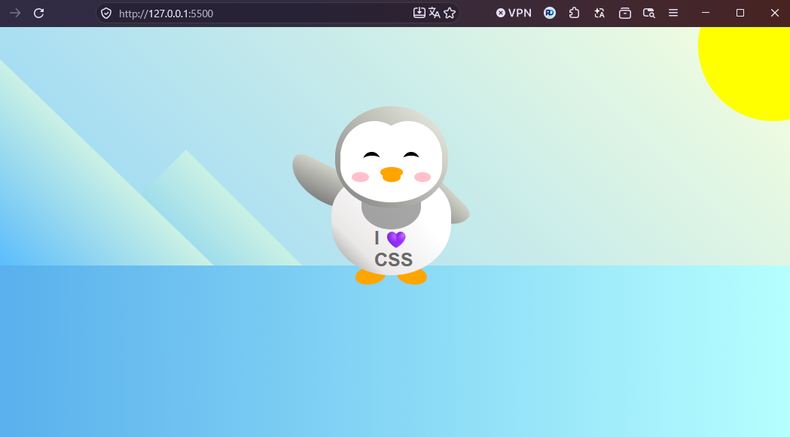

# Flappy Penguin en CSS

Un pingouin qui salue, dessiné et animé uniquement en HTML et CSS, réalisé dans le cadre du cursus freeCodeCamp (Responsive Web Design).





## Ce que j'ai mis en pratique

- **Animations CSS** : `@keyframes` et propriété `animation` pour le salut du bras, avec `transform-origin` pour pivoter depuis l'épaule.
- **Accessibilité des animations** : `prefers-reduced-motion` coupe l'animation et la transition pour les personnes qui demandent moins de mouvement.
- **Transforms et transitions** : `rotate`, `skew`, `scaleX` et un agrandissement fluide du pingouin au clic.
- **Dessin en CSS pur** : des `div` positionnées en `absolute` / `relative`, `border-radius` en pourcentages, dégradés linéaires et `z-index`.
- **Variables CSS** : les couleurs du pingouin sont centralisées dans `:root`.

## Ce que j'ai ajouté au workshop

Le projet part du workshop guidé « Build a Flappy Penguin » de freeCodeCamp. Mes ajouts personnels :

- Structure sémantique (`<main>`, `meta description`) et illustration décrite avec `role="img"` et `aria-label`.
- Page défilable sur petit écran (`min-height` au lieu d'une hauteur fixe).
- Variables et noms de classes relus et clarifiés.

## Technologies utilisées

HTML5 et CSS3, sans JavaScript ni bibliothèque externe.

## Installation locale

```bash
git clone https://github.com/DocariDR/flappy-pinguin-freecodecamp.git
cd flappy-pinguin-freecodecamp
```

Puis ouvre `index.html` dans ton navigateur.

## Structure des fichiers

```
flappy-pinguin-freecodecamp/
├── index.html
├── styles.css
├── screenshot.png
└── README.md
```

## Auteur

**Ricardo Dovonou** (DocariDR), développeur web junior en formation, Abomey-Calavi, Bénin.

- GitHub : [github.com/DocariDR](https://github.com/DocariDR)
- LinkedIn : [linkedin.com/in/ricardo-dovonou](https://linkedin.com/in/ricardo-dovonou)
- X : [x.com/DocariDR](https://x.com/DocariDR)
- Bluesky : [bsky.app/profile/docaridr.bsky.social](https://bsky.app/profile/docaridr.bsky.social)
- Portfolio : [portfolio-docaridr.vercel.app](https://portfolio-docaridr.vercel.app)